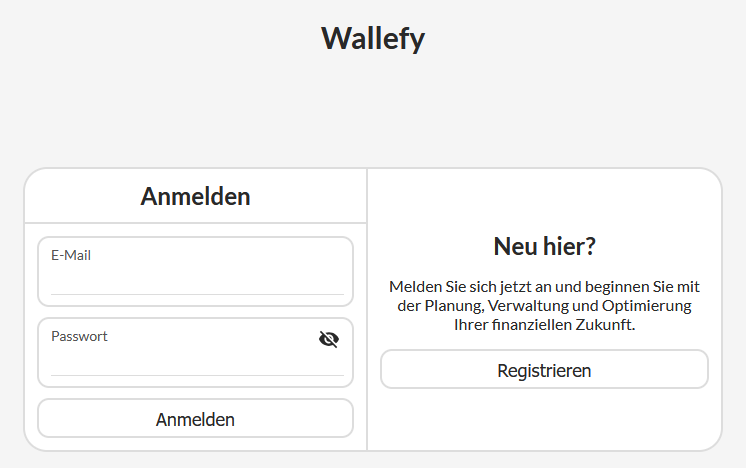
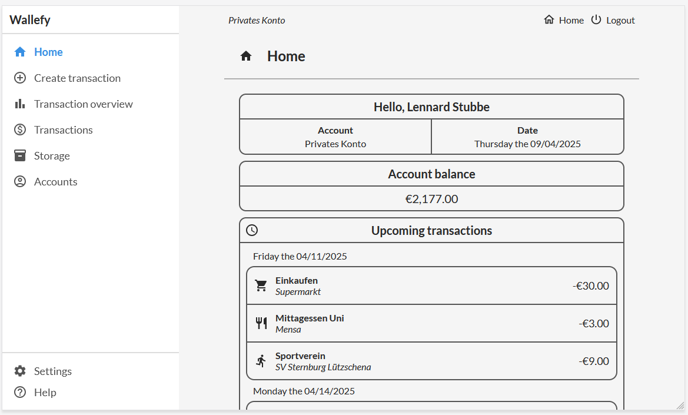
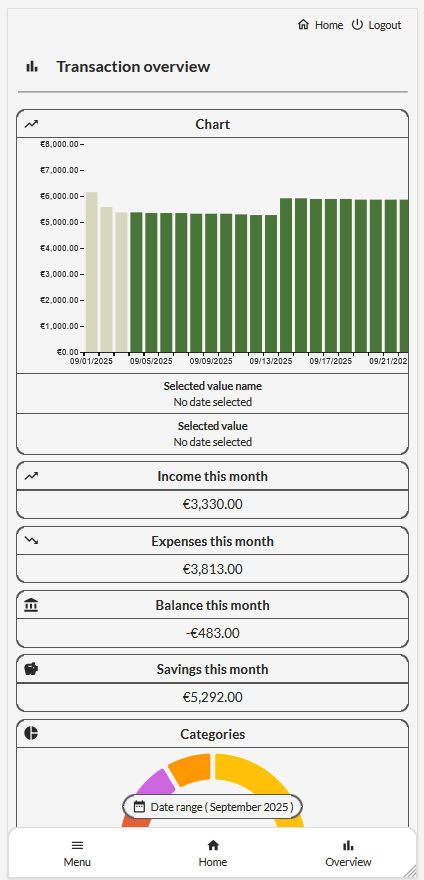
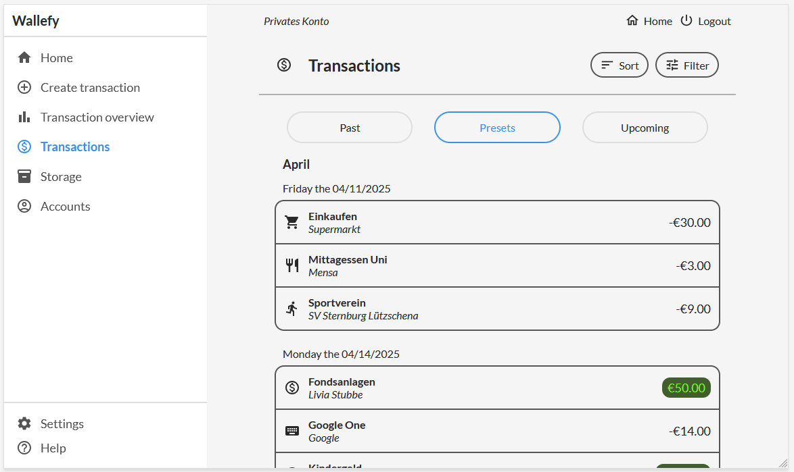
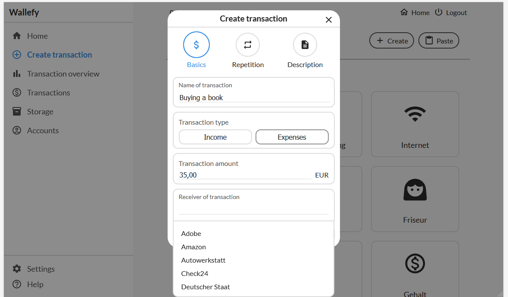
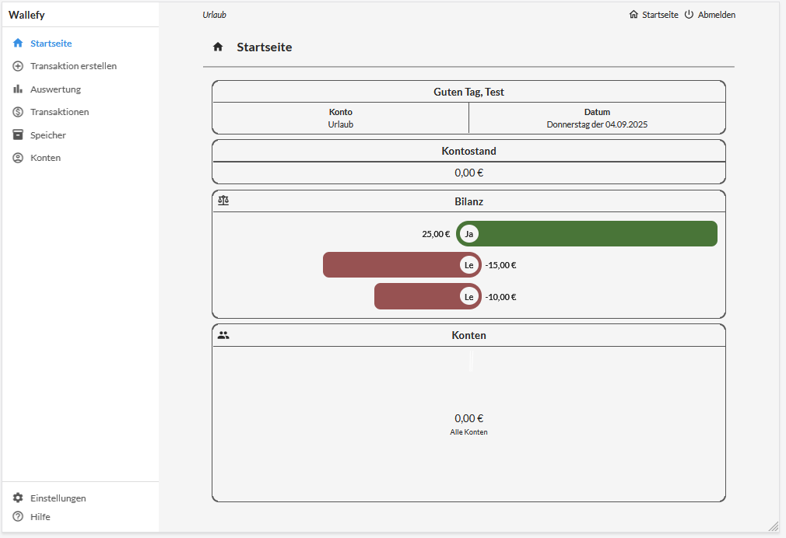

# 💰 Wallefy-Web

<!-- App Icon -->

  

## 📝 Description
**Wallefy-Web** is a modern personal finance web app built with **React** and **Firebase**.  
It allows users to track expenses and income, manage categories, and analyze their finances in real time.  

With support for **German and English**, **light and dark themes**, and both **desktop and mobile optimization**, Wallefy-Web makes personal finance management simple and accessible for everyone.  

---

## ✨ Key Features
- **Expense & Income Management** – Quickly add and manage your financial transactions.  
- **Intuitive Interface** – Easy creation of simple and complex transactions.  
- **Realtime Sync** – Firebase Realtime Database keeps your data instantly up to date.  
- **Financial Insights** – Automatic calculation of:  
  - Monthly balance  
  - Total spending per category  
  - Estimated end-of-month savings  
- **Customizable Categories** – Tailor categories for a clear overview.  
- **Shared Accounts** – Organize and manage finances together with family or friends.  
- **Debt Accounts** – Track debts and settlements, e.g. during travel.  
- **Analytics with Charts** – Visualize your financial activity.  
- **Themes & Languages** – Supports English & German, with light and dark mode.  
- **Cross-Platform** – Optimized for both desktop and mobile use.  

---

## 🚀 Development Status
- [x] Core features implemented  
- [x] Charts and analytics integrated  
- [ ] Data encryption  
- [ ] Additional language support  
- [ ] UI/UX refinements  

---

## 🖼️ Screenshots

### 🔐 Authentication

  

### 📊 Overview & Charts

  
  

### 💸 Transactions

  
  

### 🤝 Shared & Debt Accounts

  

---

## 🌐 Links
- [🌍 Official Website](https://example.com)  
- [📖 Documentation](https://example.com/docs)  

---

## 🛠️ Technology
- **Frontend**: React  
- **Backend**: Firebase Realtime Database  
- **Authentication**: Firebase Auth (optional)  

---

## 👥 Developer
- Lennard Stubbe ([GitHub](https://github.com/LS-Studios))  

---

## ⚖️ License
This project is licensed under the **MIT License**.  
See [LICENSE](LICENSE) for details.